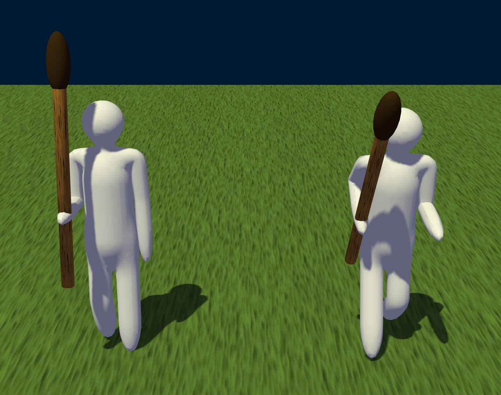

# Test Animation

The Test Animation tester (`deepsea_test_animation_app` target) tests the Animation library with skinning.

Two animated characters are displayed holding a torch. Both characters are separate instances of the same node hierarchy, demonstrating that the state can be set separately. Both characters can be cycled between an idle, walk, and run animation, smoothly interpolating between them, while the left character also utilizes a static `dsDirectAnimation` to force the arm holding the torch up. The torch is connected with a `dsSceneAnimationTransformNode` to stay connected to the hand.

The animations of the left character can be cycled by pressing the `1` key, while the right character animations can be cycled by pressing the `2` key. On mobile platforms, a one-finger tap cycles through the left character animations and a two-finger tap cycles through the right character animations.

