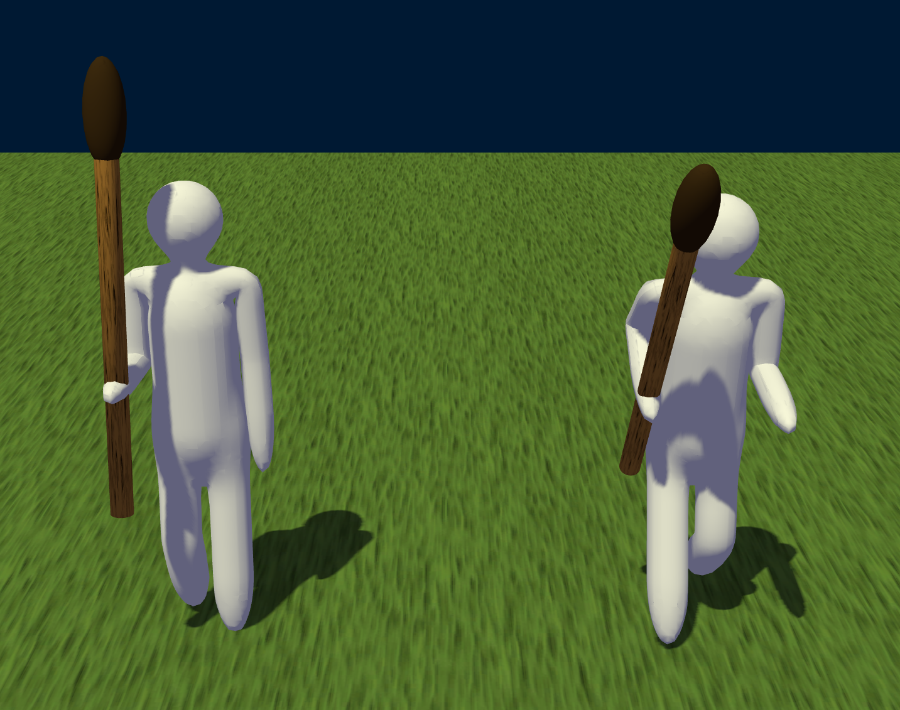

# Test Animation

The Test Animation tester (`deepsea_test_animation_app` target) tests the Animation library with skinning.

Two animated characters are displayed holding a torch. Both characters are separate instances of the same node hierarchy, demonstrating that the state can be set separately. Both characters can be cycled between an idle, walk, and run animation, smoothly interpolating between them, while the left character also utilizes a static `dsDirectAnimation` to force the arm holding the torch up. The torch is connected with a `dsSceneAnimationTransformNode` to stay connected to the hand.

The animations of the left character can be cycled by pressing the `1` key, while the right character animations can be cycled by pressing the `2` key. On mobile platforms, a one-finger tap cycles through the left character animations and a two-finger tap cycles through the right character animations.

This tester demonstrates both dynamic updates, where the time is advanced based on the last frame time, and fixed updates. It will use a dynamic update by default, but a fixed update may be chosen on the command-line with the `-u/--update-fps` option, passing the desired FPS to update at. For example, `-u 60` will update at 60 FPS (1/60th of a second), and `-u 25` will update at 25 FPS (1/25th of a second) The animation should still appear smooth due to interpolating between each update, but very low FPS values may have noticeable issues due to sparse sampling of the animation curves. The `V` key may be used to toggle vsync, both to test for performance and view the difference in update behavior.

