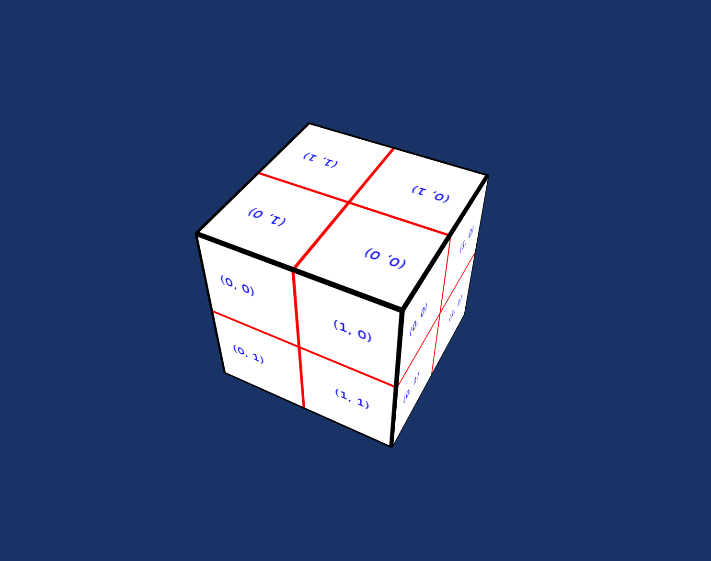

# Test Cube

The Test Cube tester (`deepsea_test_cube_app` target) tests basic rendering functionality be displaying a spinning, textured cube.

The following keys can test behavior of the renderer:

* `1`: toggle anti-aliasing. This will open a new window as some platforms tie anti-aliasing to the window surface.
* `2`: toggle vsync.
* `3`: toggle anisotropic filtering.

