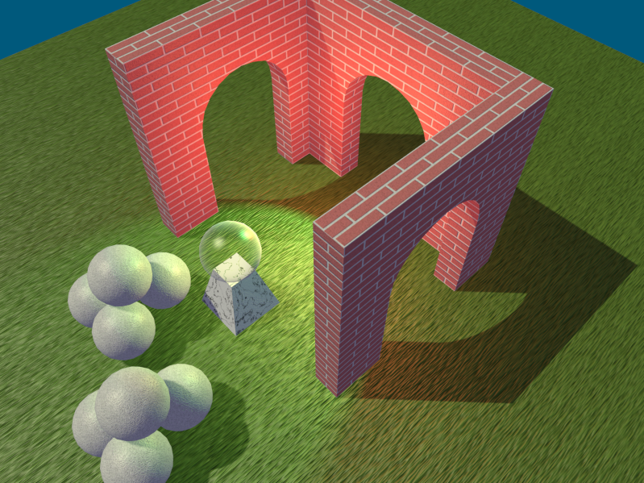
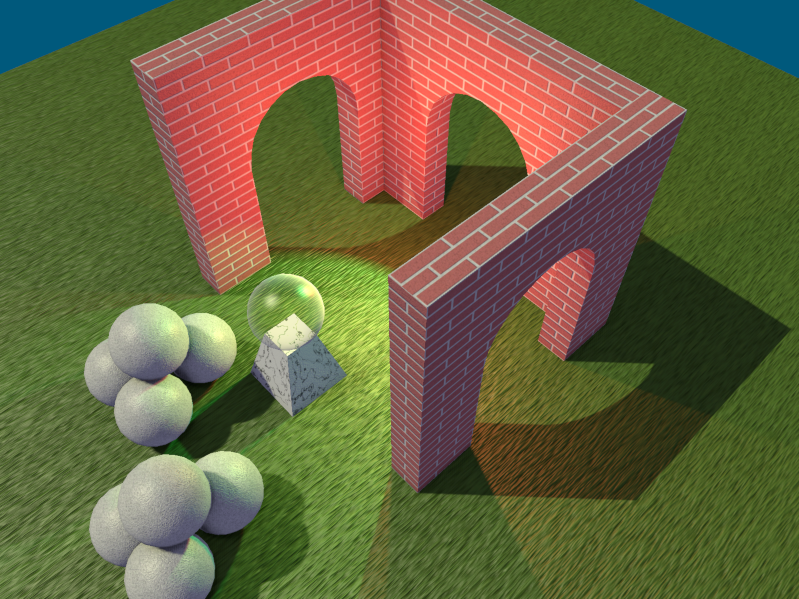

# Test Lighting

The Test Lighting tester (`deepsea_test_lighting_app` target) tests vrious lighting techniques. This includes:

* Forward lighting
* Deferred lighting
* Directional light shadows, with and without cascades
* Spot light shadows
* Point light (omnidirectional) shadows
* Screen-space ambient occlusion (SSA)

The forward lighting mode only displays displays cascaded directional shadows for the "sun" light. The other two lighting modes use deferred lighting and are without and with SSAO, respectively. Deferred lighting modes have shadows for all three lights, using non-cascaded shadows for the directional light.

The following keys can test behavior of the lighting:

* `1`: toggle anti-aliasing for forward lighting. Unlike other testers, this only toggles anti-aliasing for offscreen render targets, so it doesn't require re-creating the window surface.
* `space`: pause/unpause spinning of the scene.
* `enter`: cycle through the lighting modes in the order of forward, deferred, deferred with SSAO.

On mobile platforms, a one-finger tap pauses/unpauses spinning of the scene and a two-finger tap cycles through the lighting moves.

## Test cases

The following screenshots demonstrate the three lighting modes that are tested.

### Forward lighting

### Deferred lighting

### Deferred lighting with SSAO

