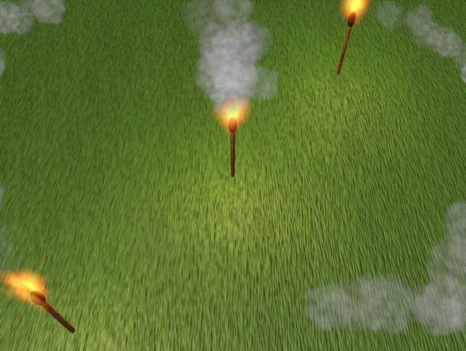

# Test Particles

The Test Particles tester (`deepsea_test_particles_app` target) tests drawing of particles in a scene. The scene contains three torches that emit fire and smoke, one that's stationary in the center and two that rotate. The rotating torches will have a trail of smoke that follows them, demonstrating the ability to have a separate transform for the volume to spawn and display of the particles. The torches also emit a flickering point light, which tests integration of lights into the scene graph with `dsSceneLightNode`.

The following keys can test the behavior of the application:

* `space` (one-finger tap on mobile): pause/unpause the rotation of the torches.
* `1` (two-finger tap on mobile): extinguish or light the center torch. Extinguishing the torch will stop any new particles from being created, but the existing particles will continue to move. The light will also be removed when it is extinguished.
* `2` (three-finger tap on mobile): toggle whether or not one of the rotating torches is visible. This will fully remove it from the scene graph, removing the particle emitters and light.

