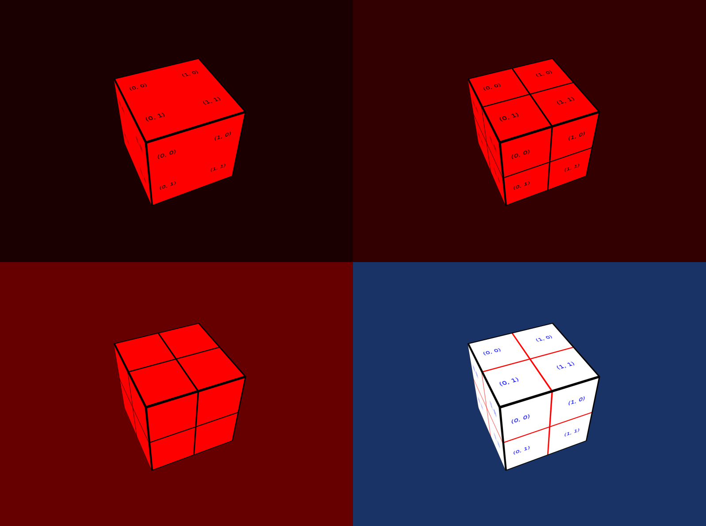
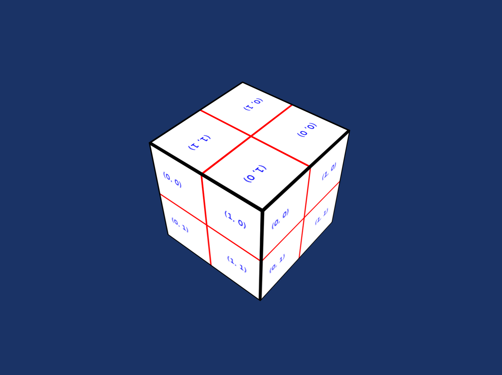

# Test Render Subpass

The Test Render Subpass tester (`deepsea_test_render_subpass_app` target) tests multiple subpasses within a render pass. A spinning, textured cube is drawn in three passes, one for each color channel, then combines the results into the full color image using subpass lookups.

When scaled blitting is supported, the three subpasses and final result are displayed all at once.

When scaled blitting is not supported (e.g. Metal), only the final result is displayed.

