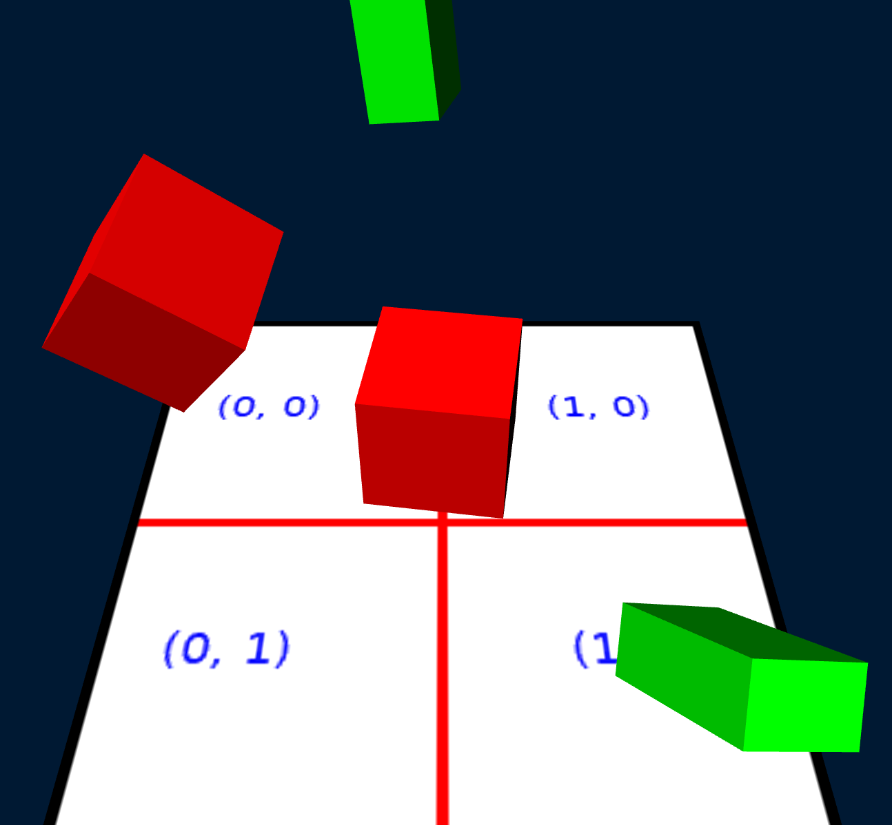

# Test Scene

The Test Scene tester (`deepsea_test_scene_app` target) tests basic rendering a basic scene graph. The scene graph contains the following elements:

* Textured ground plane that is stationary.
* Subscene of a central red cube and green box with a transform to the red cube. This has two instances:
	1. Spinning with the red cube in the center of the scene, green box orbiting around it.
	2. A second reference to the red cube and green box subscene under a moving transform. This is rotating relative to the transform of the first instance, which has the visual effect of translating back and forth as the subscene rotates.

A custom `dsSceneGlobalData` instance is used for basic lighting, demonstrating reading a custom type in the scene layout.

The following keys can test behavior of the scene rendering:

* `1`: toggle anti-aliasing. This will open a new window as some platforms tie anti-aliasing to the window surface.
* `2`: toggles displaying the secondary scene of the red cube and green rectangle.
* `3`: Toggles multithreaded rendering. This uses multiple threads to process the different item lists in the scene. This is primarily used to verify that the system works, though larger scenes may see a performance improvement on multi-core systems.

