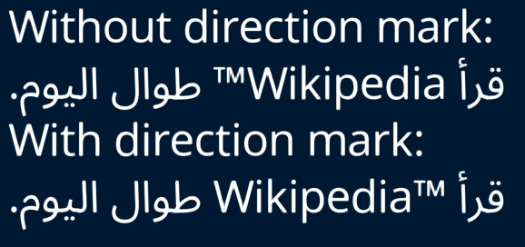

# Test Text

The Test Text tester (`deepsea_test_text_app` target) tests displaying text. Various cases of different scripts, right to left text, line wrapping, etc. are tested across the various pages.

When running the tester, the left and right arrow keys can be used to cycle through the different test cases. On mobile devices with a touchscreen, a one-finger tap cycles forward and two-finger tap cycles backwards.

## Command-line options

In addition to the common command-line options, the following options are supported:

* `-f/--font <font-path>`: path to the font to use in place of the default for latin text.
* `-l/--low`: use low quality text.
* `-m/--medium`: use medium quality text. This is the default.
* `-H/--high`: use high quality text.
* `-v/--very-high`: use very high quality text.

## Test cases

The following test cases are present. When tessellation shaders are available, there are two copies of the text: one using standard quads and another using a tessellation shader to expand a point into a quad. Apart from the first test case, the tessellation shader text should be identical and aren't included with the example screenshots.

### Basic text with instructions

### Emboldened text

### Forward slanted text

### Backward slanted text

### Outlined text

### Multiple styles with different text ranges

### Different sized text

### Different sized text with outlines

### Different sized text in the same line

### Line wrapping mixed with explicit newlines

### Line wrapping with each word too long

### Line wrapping with centered text

### Line wrapping with right-justified text

### Mixed scripts

### Right-to-left text with punctuation

### Right-to-left text with line wrapping

### Right-to-left text with newlines

### Line wrapping on a script transition

### Right-to-left text at the start and end of the input string

### Unicode text direction marker

### Script transitions with inherited scripts

### Negative Y offset

### Positive Y offset

### Uniform text mode with Latin text

### Uniform text mode with Arabic text

### Icons

