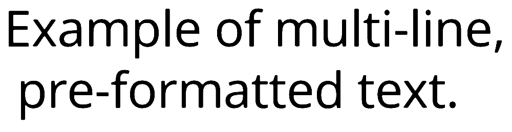
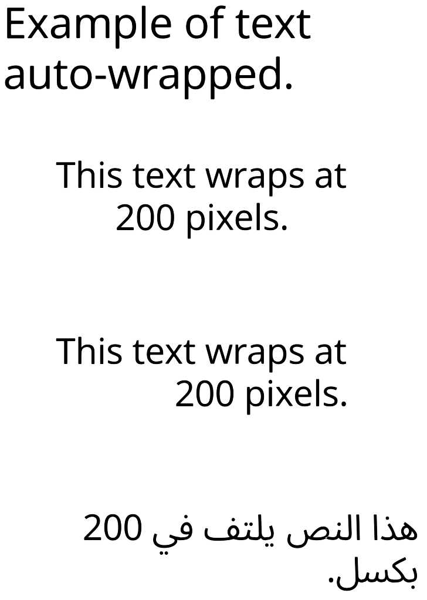
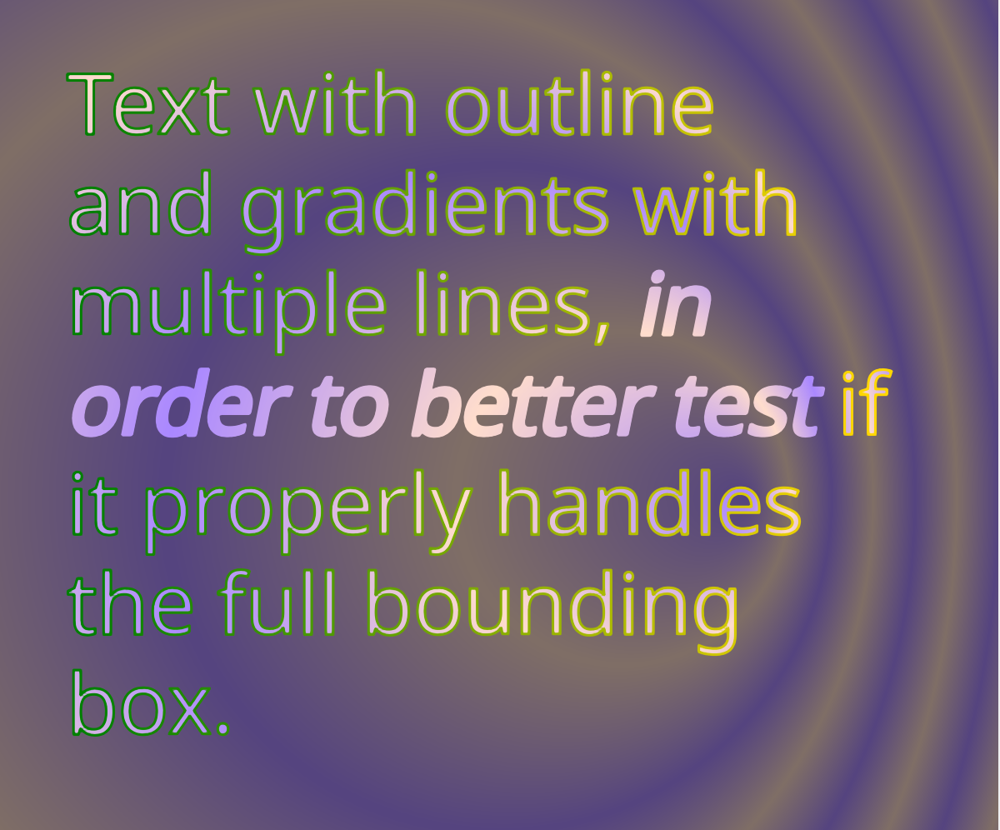
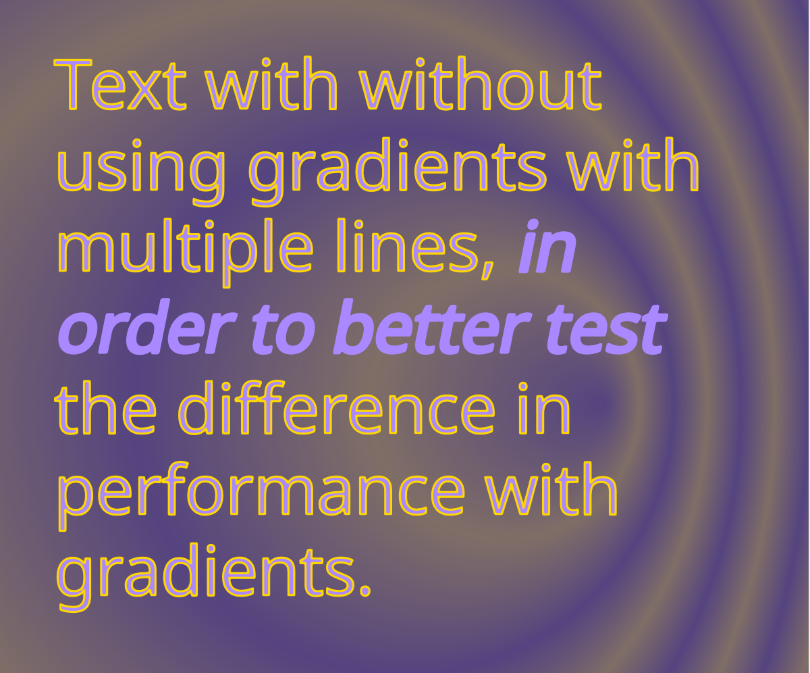
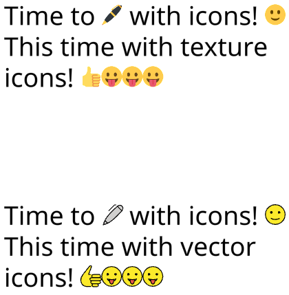

# Test Vector Draw

The Test Vector Draw tester (`deepsea_test_vector_draw_app` target) tests displaying vector images converted from SVGs. Various cases of different shapes, materials, and text are tested.

When running the tester, the left and right arrow keys can be used to cycle through the different test cases. On mobile devices with a touchscreen, a one-finger tap cycles forward and two-finger tap cycles backwards. The `w` key may be used to toggle displaying wireframe. The `--srgb` command-line parameter may optionally be passed to perform sRGB correct rendering, where the gradients are computed in linear color space.

## Test cases

Most test cases can be verified by viewing the SVG files in an SVG viewing or editing application, such as Inkscape or a web browser. Some of the text test cases don't display properly in most SVG viewers, so screenshots are provided below for the expected results.

### Multi-line, pre-formatted text

### Auto-formatted text

### Text using gradients

### Text without gradients

This test is primarily used to compare performance of text with and without gradients. The performance difference is especially prominent with integrated GPUs.

### Text with icons

