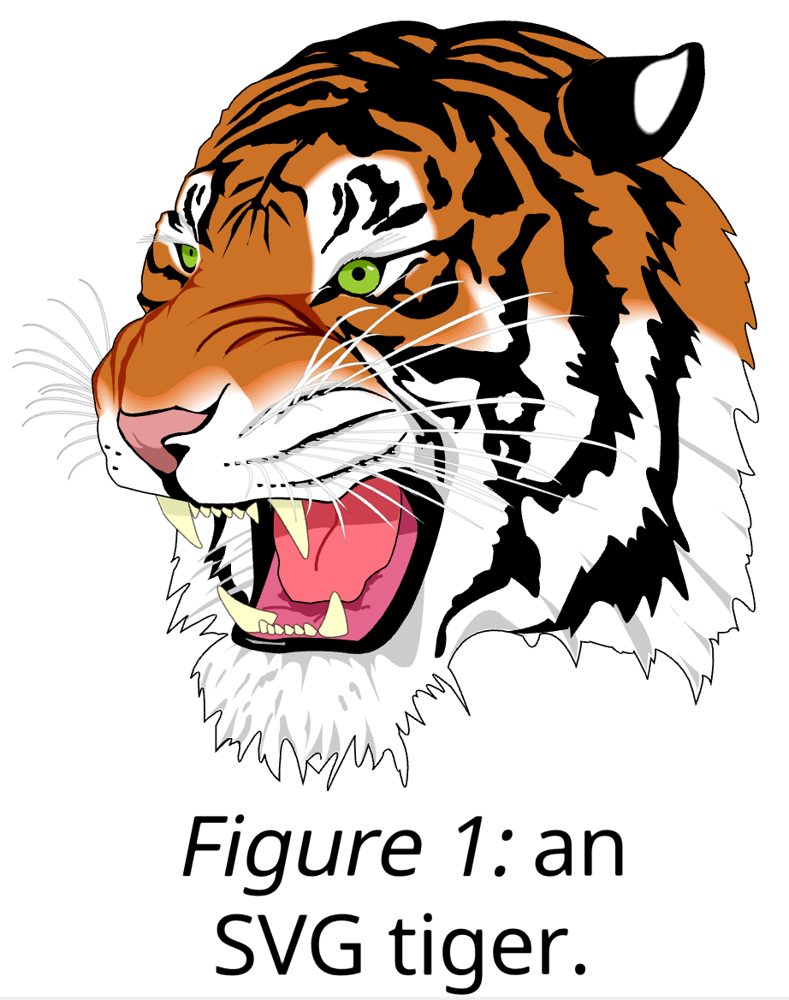
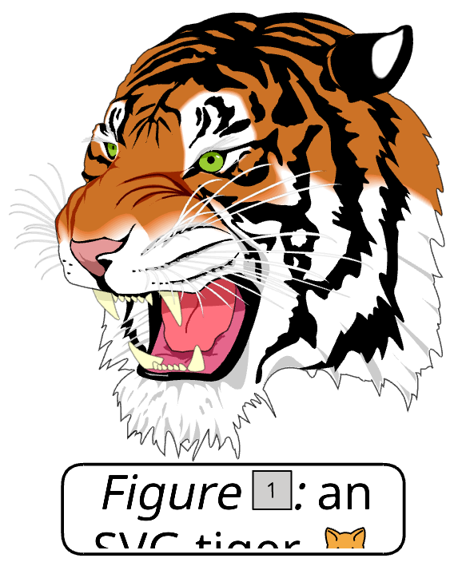

# Test Vector Draw Scene

The Test Vector Draw Scene tester (`deepsea_test_vector_draw_scene_app` target) tests displaying vector images within a scene graph. The text will be revealed character by character, delays for a while after being fully revealed, then clears and reveals again. The text also replaces specific characters with icons, which themselves are also vector images.

You may press the 1 key to toggle between text that displays character by character and a text box that cuts off the text outside of that text, scrolling up and down to reveal different parts of the text.

